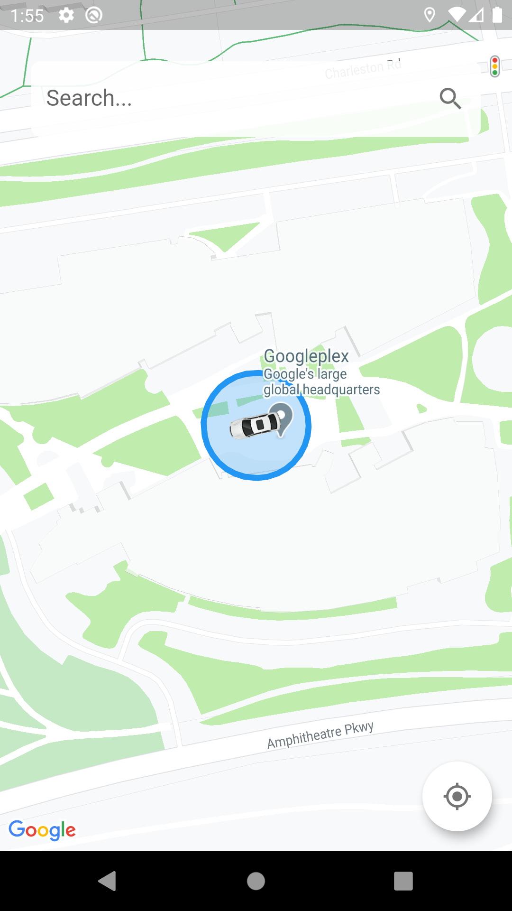

# Location_Trackong

A new Flutter application for user location tracking with the ability of assign runtime tasks.

**Packages we are using:**
- [flutter_bloc](https://pub.dev/packages/flutter_bloc)
- [location](https://pub.dev/packages/https://pub.dev/packages/location)
- [google_maps_flutter](https://pub.dev/packages/google_maps_flutter)
- [cloud_firestore](https://pub.dev/packages/cloud_firestore)

Note that the app is under development
